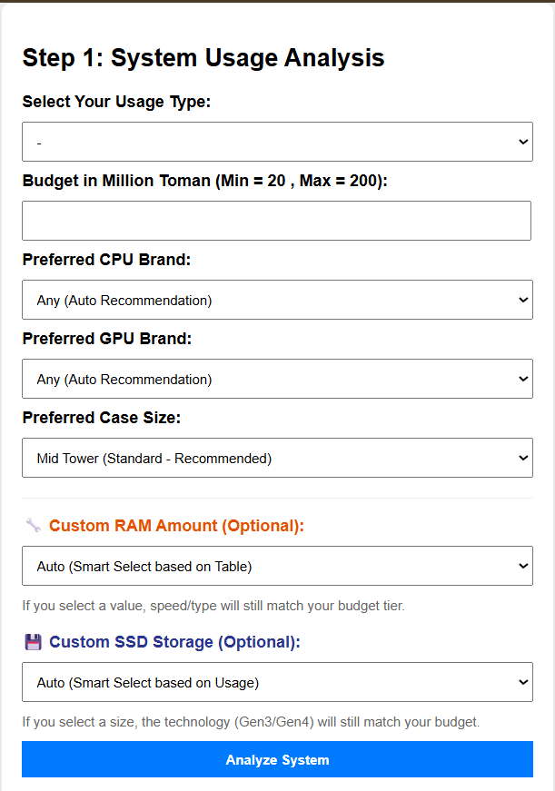
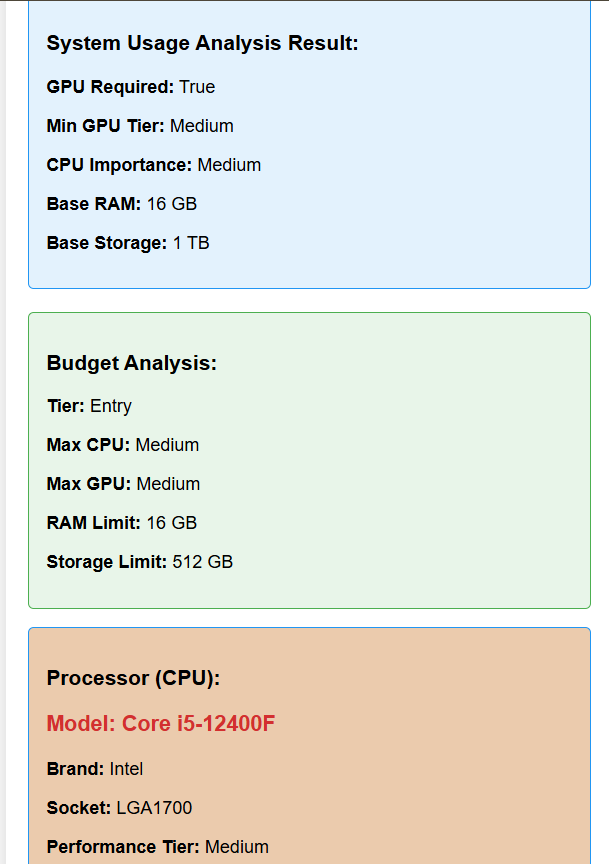
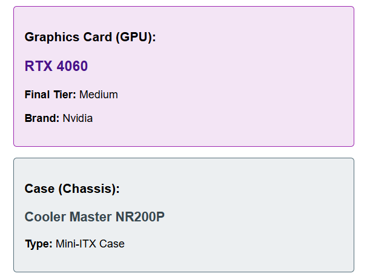
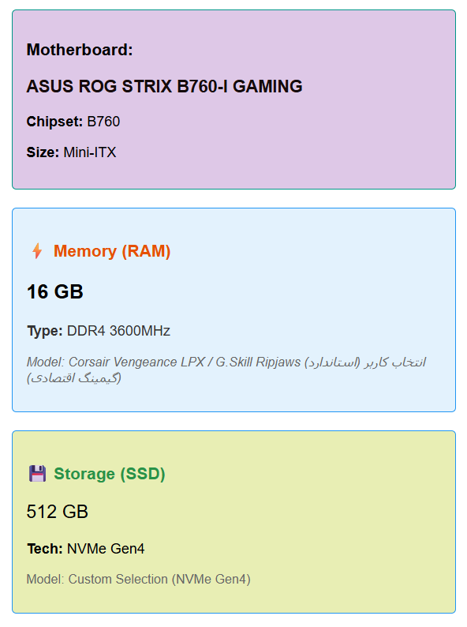

# Expert-System-for-Consultation-and-Configuration-of-PC-Hardware-

````markdown
# 💻 PC Component Recommender Expert System

A rule-based **Expert System** developed in Python that simulates a hardware consultant's logic to recommend optimal computer components based on specific user needs and constraints.

---

## 🧠 System Overview

This project implements a classic **Production System** architecture. It separates the domain-specific knowledge from the reasoning mechanism, allowing for easy updates to the hardware database.

### Core Components:

- **Knowledge Base:** A structured set of $IF-THEN$ rules derived from hardware specifications and compatibility standards.
- **Inference Engine:** A logical processor that matches user inputs against the knowledge base to reach a goal.
- **Explanation Facility:** Provides the reasoning behind each recommendation (The "Why" factor).

---

## 🛠 Methodology: The Mockler Approach

The system design follows the **Mockler Methodology**, ensuring a structured transition from human expertise to machine logic:

1.  **Domain Categorization:** Defining the scope for 7 key hardware variables.
2.  **Dependency Mapping:** Using Mockler Diagrams to visualize how inputs affect the final decision.
3.  **Decision Tables:** Mapping all possible combinations to ensure logical consistency and prevent rule conflicts.

---

## 📋 Input Parameters

The system evaluates the following factors to generate a recommendation:

- **User Profile:** Office, Gaming, or Workstation.
- **Budget:** Entry-level, Mid-range, or High-end.
- **Target Hardware:** Preferred CPU series, GPU tier, RAM capacity, Storage type, and Case form factor.

---

## 📸 Screenshots & Demo

### 1. User Input Interface

> 

### 2. Recommendation Result

> [!TIP]
> _These screenshots showing the final suggested list of parts._
> 
> 
> 

## 🚀 Installation & Usage

1. **Clone the repository:**
   ```bash
   git clone https://github.com/nadimnikzai/Expert-System-for-Consultation-and-Configuration-of-PC-Hardware-.git
   ```
````

````

2. **Navigate to the directory:**

```bash
cd pc-expert-system

````

3. **Run the system:**

```bash
python main.py

```

---

## 🛠 Technologies Used

- **Language:** Python 3.x
- **Logic:** Rule-based Inference
- **Documentation:** Mockler Diagrams & Decision Tables

```

```
